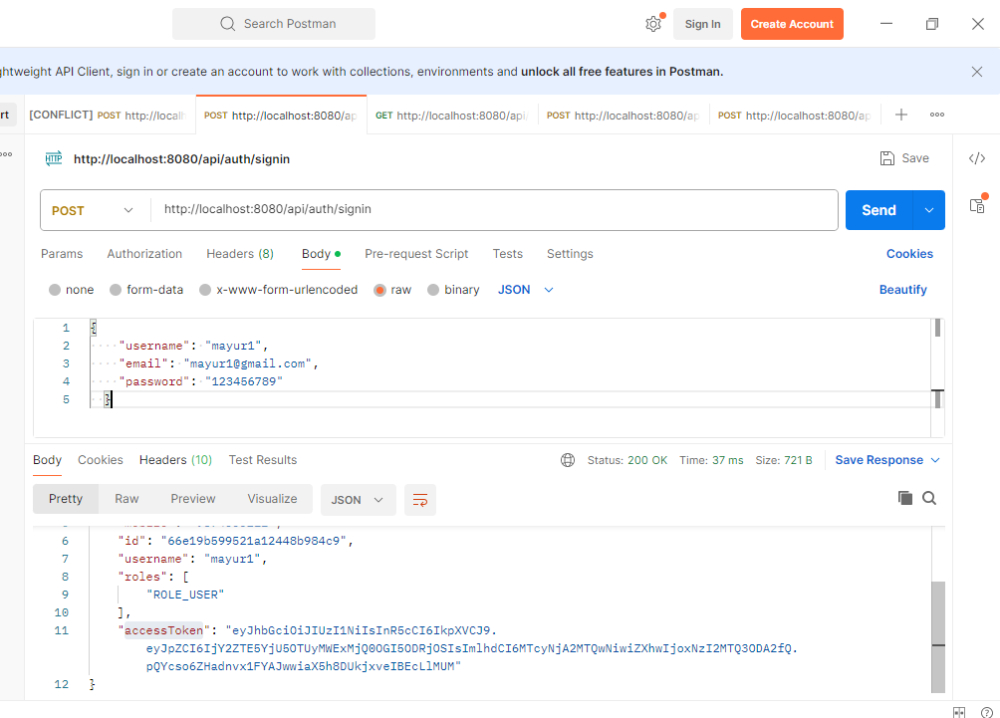
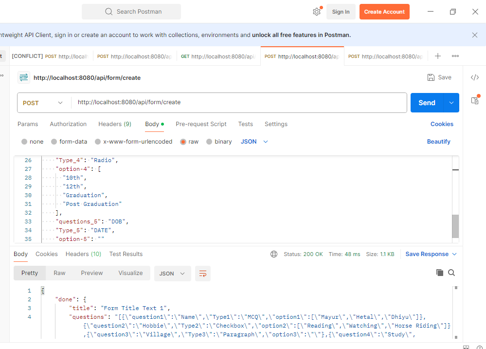
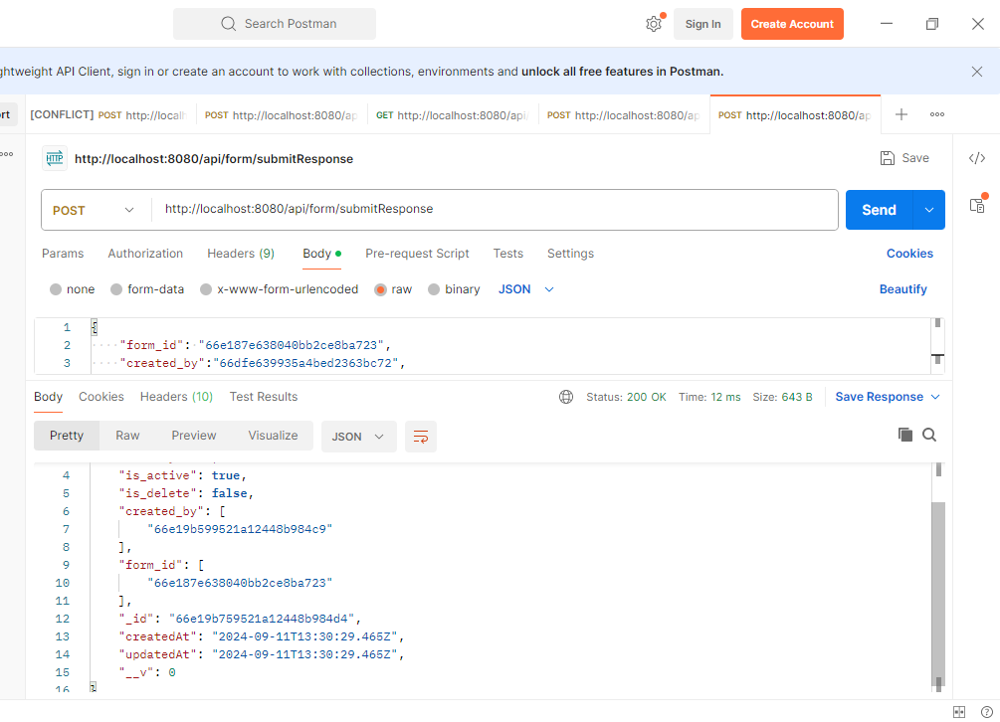

# Node.js Express & MongoDB:
Pre-requisites
You will need to have access to the command-line, for Linux/Mac a Terminal or on Windows it will be a command prompt (cmd)
You will need to have git installed: http://git-scm.com/downloads
NodeJS & npm - https://nodejs.org or via NVM (https://github.com/creationix/nvm)
Check .env file

### Project setup
```
npm install
```

### Run 
```
npm start
```

Tasks that Completed Given in Assigment
1. An API to create surveys.
2. An API to store the survey responses.
3. An API to visualise survey responses(Get all form response in JSON)
4. API to edit the Survey Response
5. API to maintain the History of Responses(When user edit the Survey Response, previous answers will be store in history field of same response doc)

Tasks that Completed NOT Given in Assigment
1. User Management with "jsonwebtoken"
2. Create User API, with validation check Duplicate Username Or Email.
3. SignIn User API, with token response.
4. Added Middle to verifyToken, check isAdmin(for some Admin route)
5. Add auto Role docs if not Exist.
6. Started Sample of Unit test, but not completed.

Some Screenshot of Postman

Signin

Create form

Submit respose

